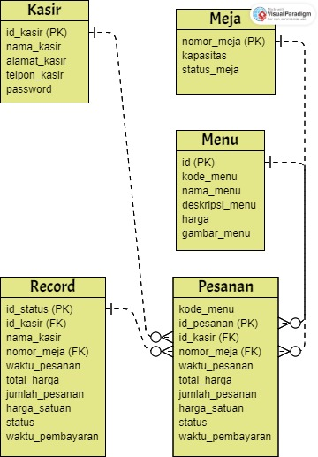

# Restaurant Management System
Ini adalah sistem manajemen restoran sederhana yang dibangun menggunakan Node.js dan MySQL. Sistem ini memungkinkan pengguna untuk mengelola meja, menu, pesanan, dan status pesanan dalam sebuah restoran.

# Daftar Isi
- Instalasi
- Konfigurasi Database
- Menjalankan Aplikasi
- Endpoint API
- Penggunaan
- Kontribusi
- Lisensi

Instalasi
Clone repositori ini:
git clone [https://github.com/nama-pengguna/repo.git](https://github.com/Jaticindy/Simple-restaurant-waiting-list.git)

Masuk ke direktori proyek:
cd restaurant-management-system

Install dependencies dengan menggunakan npm:
npm install

# Konfigurasi Database
Buat file konfigurasi database dengan nama config.js dalam direktori config. Contoh isi file konfigurasi:

var db = mysql.createConnection({
  host: process.env.DB_HOST ,
  user: process.env.DB_USER,
  password: process.env.DB_PASSWORD,
  port: process.env.DB_PORT,
  database: process.env.DB_NAME
})

Pastikan untuk mengganti username, password, dan nama_database dengan informasi yang sesuai.

Import file database.sql ke dalam database MySQL untuk membuat skema dan tabel yang diperlukan.

# Menjalankan Aplikasi
npm start
Aplikasi akan berjalan pada http://localhost:3000.

# Endpoint API
Berikut ini adalah daftar endpoint API yang tersedia:

- GET /pesanan - Mendapatkan daftar pesanan

- POST /pesanan - Menambahkan pesanan baru

- DELETE /pesanan/:nomor_meja - Menghapus pesanan berdasarkan nomor meja

- GET /pesanan/status - Mendapatkan status pesanan

- POST /meja - Menambahkan meja baru

- PUT /meja/:nomor_meja - Mengubah status meja

- DELETE /meja/:nomor_meja - Menghapus meja berdasarkan nomor meja

- POST /menu - Menambahkan menu baru

- PUT /menu/:id_menu - Mengubah menu

- DELETE /menu/:id_menu - Menghapus menu berdasarkan ID menu

# ERD

# Penggunaan
- Untuk endpoint KASIR ada beberapa metode HTTP ada get,post,pul,delete. didalam ada
- get kasir bertugas, melihat nama nama kasir yang aktif.
- get meja, melihat status meja dan kapasitas kursi/bangku
- get menu, status daftar makanan dan minuman
- get total harga, jumlah harga yang di ambil dari nomor meja yang di input.
- post (pembayaran), Pembayaran pemesanan makanan / minuman dengan mengambil nomor meja yang di tempatin.
- post (pendaftaran kasir), Registrasi data baru untuk kasir aktif
- put (rubah data kasir), perubahan data kasir yang aktif
- delete (menghapus data kasir), penghapusan data kasir yang sudah non-aktif

- Untuk endpoint MEJA ada beberapa metode HTTP ada get,post,pul,delete. didalam ada
- post meja, menginput meja baru dengan kapasitas bangku.
- put meja, merubah status terisi/kosong dengan mengambil id meja
- delete meja, menghapus permanen meja dengan mengambil id meja

 - Untuk endpoint MENU ada beberapa metode HTTP ada get,post,pul,delete. didalam ada
 - post menu, menginput daftar makanan / minuman baru, dengan memasukan kode_menu 
 - put menu, merubah nama / harga suatu menu makanan/minuman
 - delete menu, menghapus nama makanan/minuman yang benar benar mau dihapus permanen

-  Untuk endpoint PESANAN ada beberapa metode HTTP ada get,post,pul,delete. didalam ada
 -get pesanan, melihat daftar makanan/minuman yang sudah di pesan. bila pembayaran sudah selesai maka diget pesanan diganti dengan rumah
 -post pesanan, menginput pesanan makanan/minuman dengan memasukan id_kasir dan id_meja
 
 -  Untuk endpoint STATUS ada satu metode HTTP ada get, menyimpan dan melihat data transaksi.
 -  
# Lisensi
Proyek

